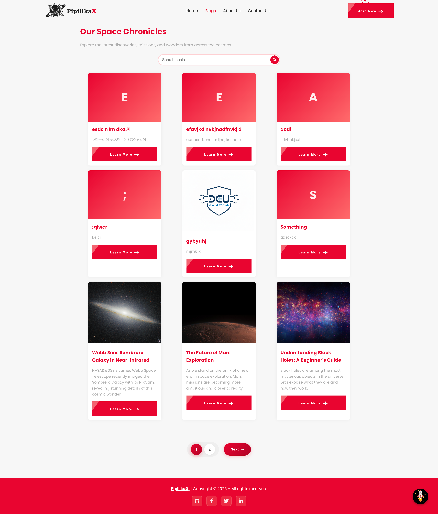
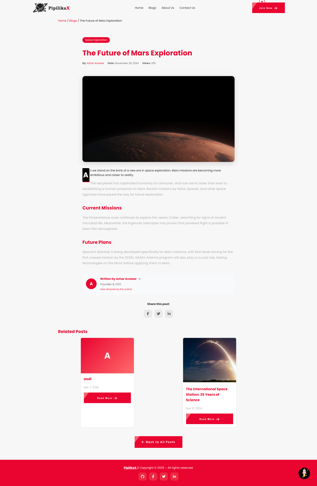
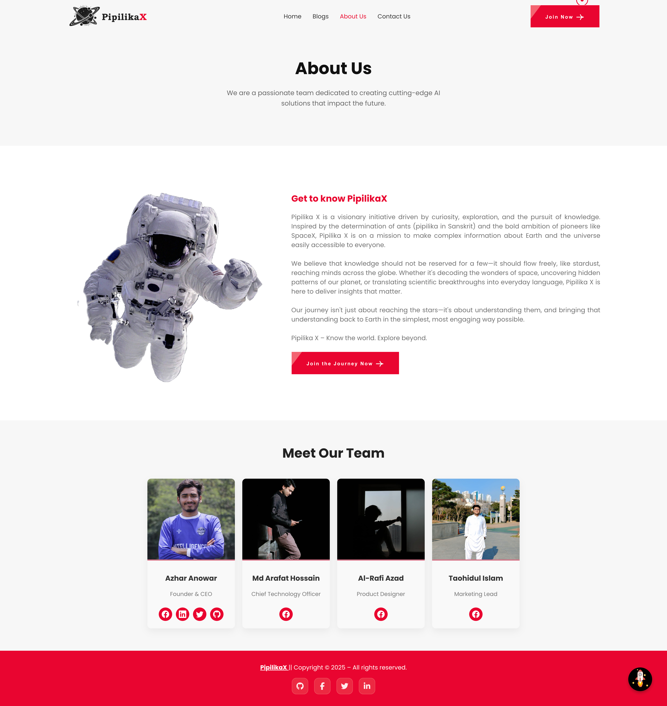
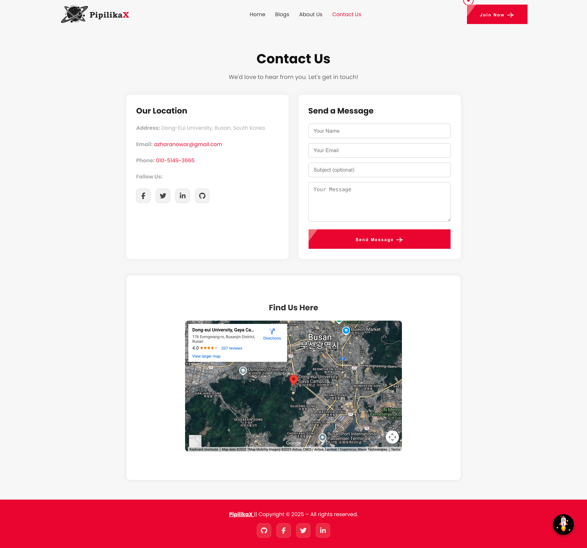
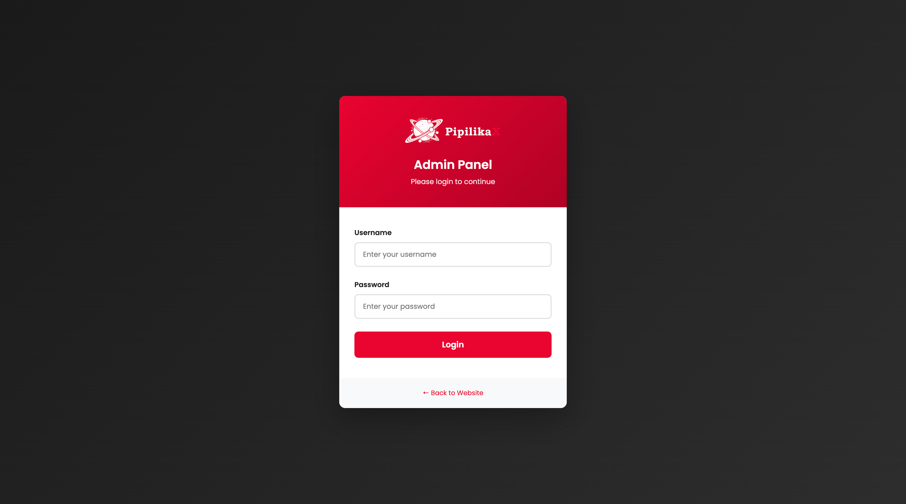
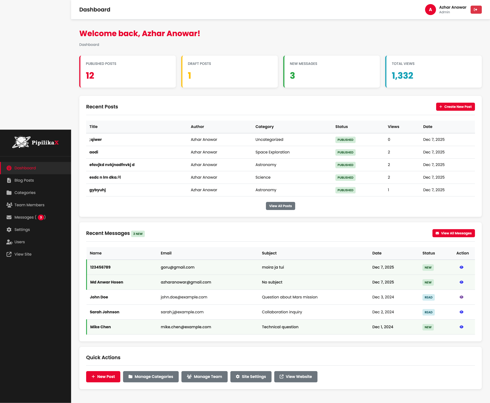
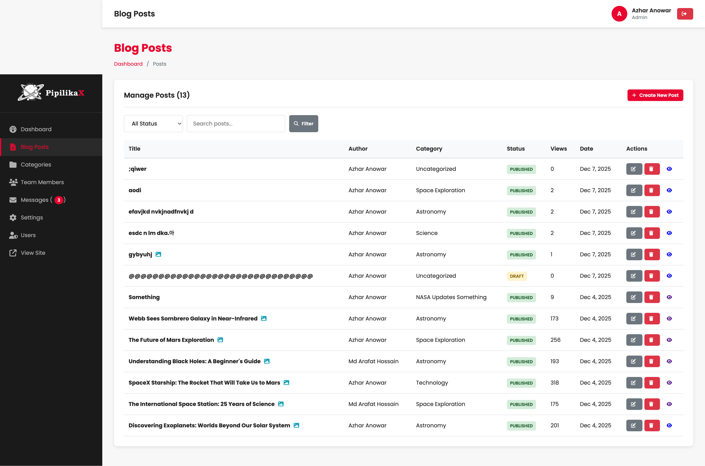
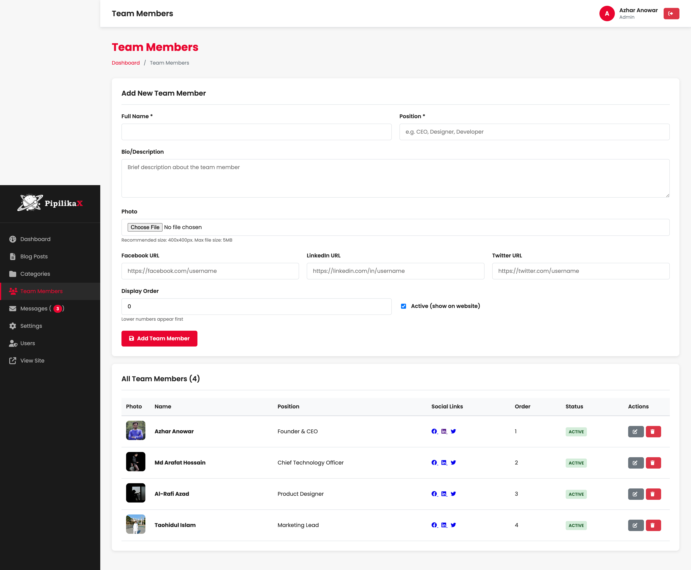
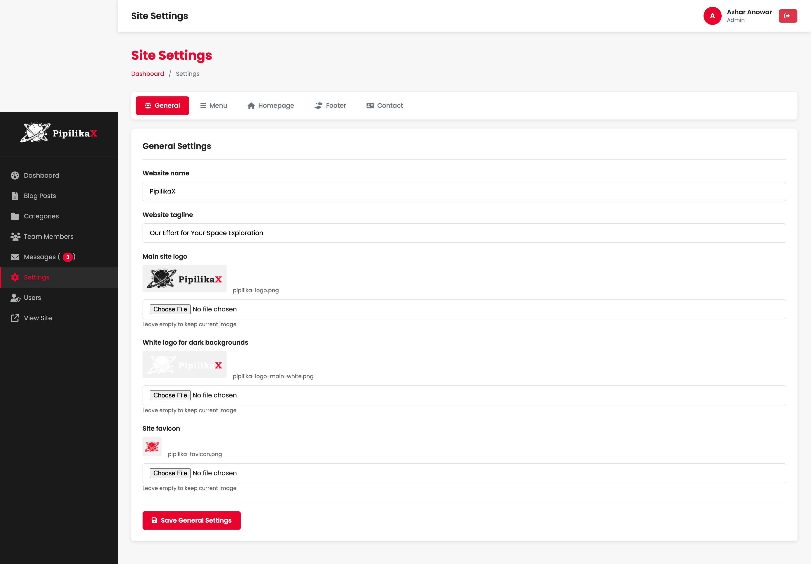
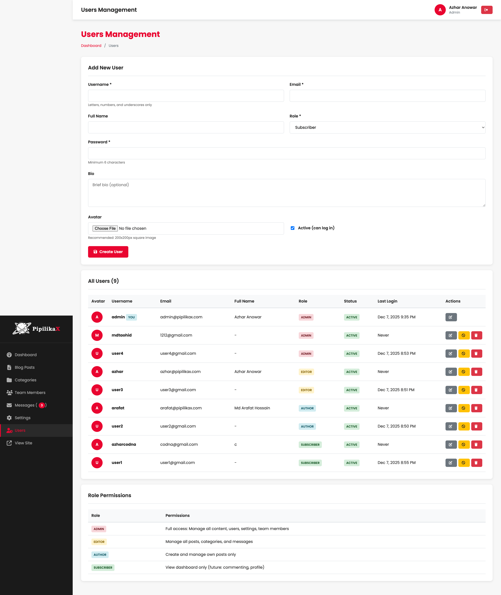

# PipilikaX Backend 🚀

**PipilikaX** is a full-stack PHP web application for a space and astronomy-themed blog/content management system. This project features a complete admin panel with user management, blog posts, team members, categories, and more.

---

## ✨ Features

### 🌐 Public Website
- **Home Page**: Animated starfield hero, solar system lineup, NASA Image of the Day API, ISS tracker
- **Blog Listing**: Filter posts by category or author, responsive grid layout with pagination
- **Blog Single**: Pretty URLs (`/blog/post-slug`), related posts, social sharing, author box
- **About Page**: Mission statement, dynamic team member profiles
- **Contact Page**: Contact form with database storage, embedded map
- **404 Page**: Animated space background with floating astronaut

### 🔐 Admin Panel
- **Dashboard**: Role-based statistics (posts, views, messages)
- **Posts Management**: Create, edit, delete posts with TinyMCE editor, featured images, categories
- **Categories**: Full CRUD for post categories with slug auto-generation
- **Team Members**: Manage team with photo uploads, roles, social links
- **Messages**: View and manage contact form submissions
- **Users**: User management with role-based permissions (Admin, Editor, Author, Subscriber)
- **Site Settings**: Configure site name, tagline, logo, social links, footer text

### 🛡️ Security Features
- Password hashing with bcrypt
- Session-based authentication with role permissions
- CSRF protection on all forms
- Image upload validation (extension + MIME type verification)
- SQL injection prevention with PDO prepared statements
- XSS protection with output escaping
- Production error handling (errors logged, not displayed)
- Secure session management (HTTPOnly, SameSite=Strict cookies)
- Session regeneration every 30 minutes
- Auto-logout after 1 hour of inactivity
- URL-friendly slug validation for posts and categories

---

## 🛠️ Technologies Used

- **Backend**: PHP 8.x, PDO/MySQL
- **Frontend**: HTML5, CSS3 (Flexbox, Grid, Animations), JavaScript ES6
- **Database**: MySQL with views for common queries
- **Rich Text Editor**: TinyMCE 6
- **Icons**: Font Awesome 6
- **APIs**: NASA APOD, ISS Tracker iframe

---

## 📁 Project Structure

```
PipilikaX-Backend/
├── admin/                  # Admin panel
│   ├── assets/             # Admin-specific CSS/JS
│   ├── includes/           # Sidebar, header, footer
│   ├── posts/              # Post management
│   ├── categories/         # Category management
│   ├── team/               # Team member management
│   ├── messages/           # Contact messages
│   ├── users/              # User management
│   └── settings/           # Site settings
├── assets/                 # Public CSS, JS, images
├── config/                 # Database & constants
├── database/               # SQL schema files
├── includes/               # Shared PHP (functions, templates)
├── uploads/                # User-uploaded files
└── [public pages].php      # Home, blog, about, contact, 404
```

---

## 🚀 Getting Started

### Prerequisites
- PHP 8.0+
- MySQL 5.7+ or MariaDB
- Apache with mod_rewrite (XAMPP, MAMP, or similar)

### Installation

1. **Clone the repository:**
   ```bash
   git clone https://github.com/azharanowar/PipilikaX-Backend.git
   ```

2. **Move to your web server directory:**
   ```bash
   mv PipilikaX-Backend /path/to/htdocs/
   ```

3. **Create the database:**
   - Create a MySQL database named `pipilikax_db`
   - Import the schema: `database/pipilikax_complete.sql`

4. **Configure database connection:**
   - Edit `config/constants.php` with your database credentials:
   ```php
   define('DB_HOST', 'localhost');
   define('DB_NAME', 'pipilikax_db');
   define('DB_USER', 'root');
   define('DB_PASS', '');
   ```

5. **Create uploads and logs directories:**
   ```bash
   mkdir -p uploads/blog uploads/team uploads/settings logs
   chmod 755 uploads logs
   ```

6. **Access the site:**
   - Public: `http://localhost/PipilikaX-Backend/`
   - Admin: `http://localhost/PipilikaX-Backend/admin/`

### Default Admin Login
- **Email**: `admin@pipilikax.com`
- **Password**: `password123`

---

## 👥 User Roles

| Role | Permissions |
|------|-------------|
| **Admin** | Full access to all features |
| **Editor** | Manage all posts, categories, messages |
| **Author** | Create and manage own posts |
| **Subscriber** | View dashboard only |

---

## 📸 Screenshots

### Public Website

#### Home Page  


#### Blog Listing  


#### Blog Post  


#### About Page  


#### Contact Page  


### Admin Panel

#### Login Page


#### Dashboard


#### Posts Management


#### Team Management


#### Site Settings


#### User Management


---

## 🔧 Configuration

### Debug Mode
In `config/constants.php`:
```php
define('DEBUG_MODE', false);  // Set to true for development
```

### Site URL
Update `SITE_URL` in `config/constants.php` for your domain.

---

Team members:
Md Anwar Hosen
Al-Rafi Azad
Md Arafat Hossain
Md Taohidul Islam

---


## 📄 License

Open-source for educational and learning purposes.

---
## 👨‍💻 Author

Developed with ❤️ by [Azhar Anowar](https://github.com/azharanowar)  
Feedback and contributions are welcome!

🛰️ *"Explore the cosmos—one scroll at a time."*
